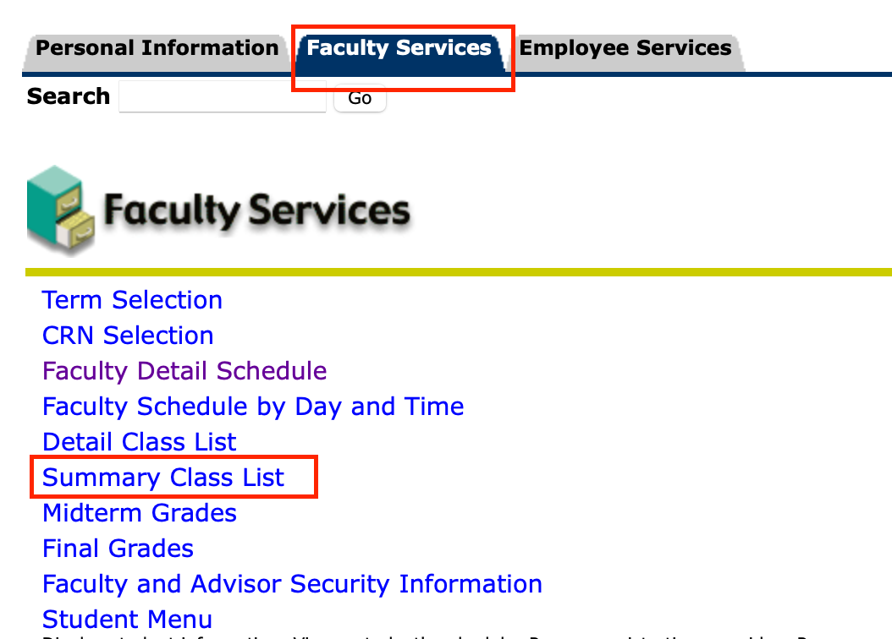
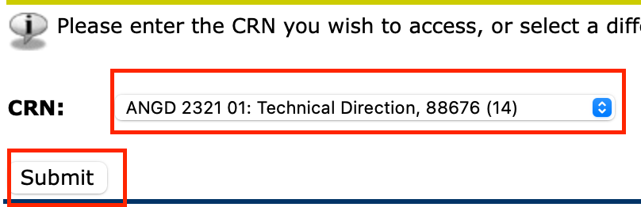

## How to view your schedule and Students

1, Go to [Cardinal Apps](https://myapps.microsoft.com), log in with your UIW email credentails. Under the ```Banner Apps``` tab, select ```Banner 8```:

<image src="assets/banner8.png">

2, Go to the ```Faculty Services``` tab, and Select ```Faculty Detail Schedule```:

<image src="assets/facultySchedule.png">

3, Select the ```Term```

<image src="assets/termSelection.png">

4, Click on the ```Submit``` button, and your schedule should show up in the next page.


5, To see your students, go to the ```Faculty Services``` tab, and Select ```Summary Class List```:



6, Pick your class and click on the ```Submit``` button.



7, Your student should apear as a list.