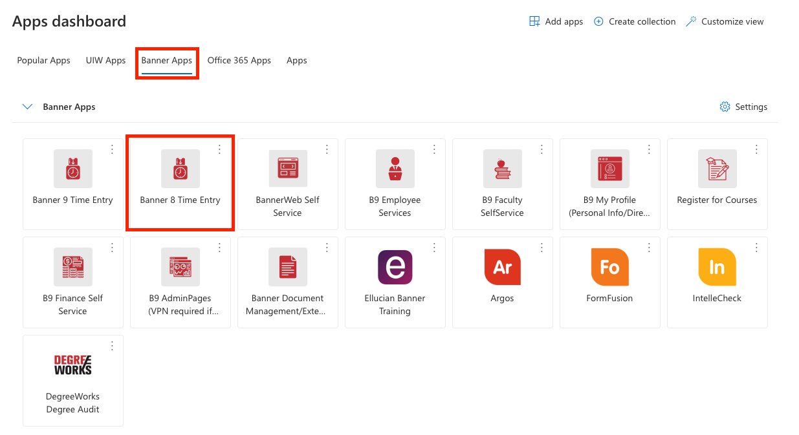
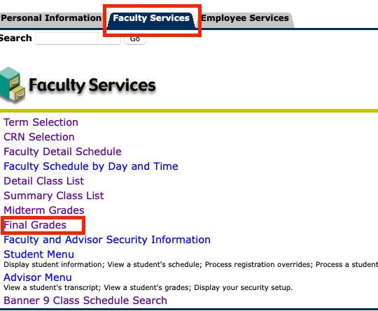
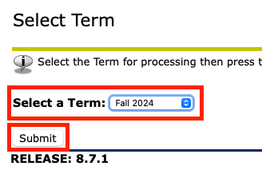
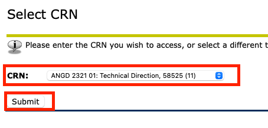
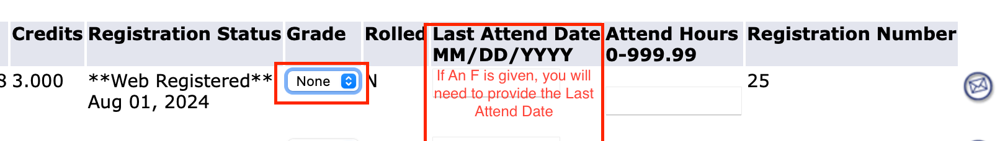

# Assign Final Grade Process

1, Go to [Cardinal Apps](https://myapps.microsoft.com), open Banner 8:



2, Under Banner 8, Go to the ```Faculty Services``` Category, and click on ```Final Grades```



3, Set the ```Select a Term``` setting to ```Fall 2024``` and click the ```Submit``` Button.



4, Set the ```CRN``` setting to your class, and click the ```Submit``` Button.



5, You just need to set the final grade for each of your students, if you are going to give any
one an F, you will need to prvoide the Last Attend Date.



