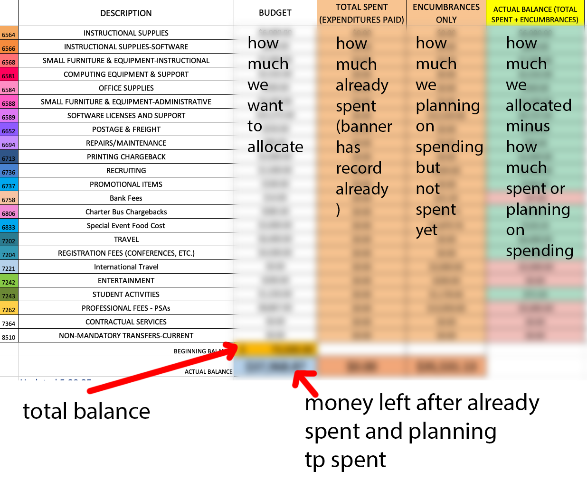

# How the Budget Sheet Works:



The image above shows the budgeting sheet, and here is what each column means:

|Column|Meaning|
|-----|----|
|Budget|how much we want to allocate for each of the category|
|Total Spent|How much we actually spent already, processed and showed on Banner.|
|Encumbrances Only|How much we are planning on spending but not yet spent yet. |
|Actual Balance|This number equals to ```Budget``` - ```Total Spent``` - ```Encumbrances only```|

```Note:``` when more spending is done, they move from the ```Encumbrances Only``` column to the ```Total Spent``` column.

The ```Beginning Balance``` Number should be the biggest number in the spreed sheet, it represent the total amount of budget allocated to the department.

The ```Actual Balance``` is the Money left after all the spendings. (including already spent, and planning to spend)