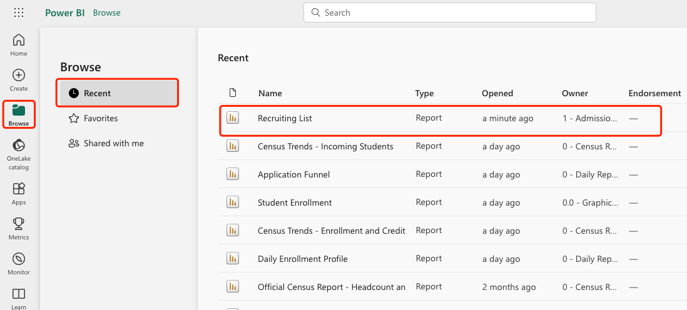
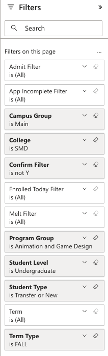
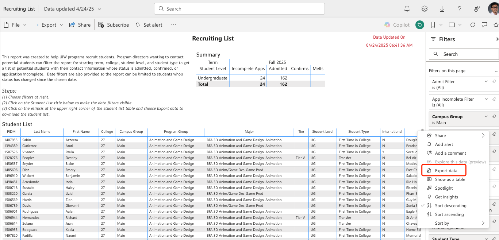
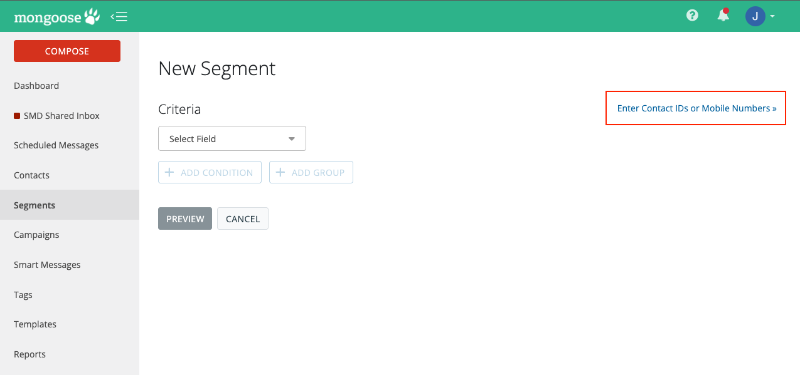

## Check Recruiting List

* Go to ```Cardinal Apps``` -> ```Power BI```
* under ```Browse```->```Shared With Me```, find recruiting list



if not finding it, ask some one that has access to it to share with you...

be sure to use the correct filter, if finding new students admited but not confirmed yet:



To download the result, click on the 3 dot on the upper right corner of the Student List table, and then select ```Export data```



Use ```Mongoose``` ```segments``` to send out messages to students that are admited but note confirmed can be a good recruitment method.

