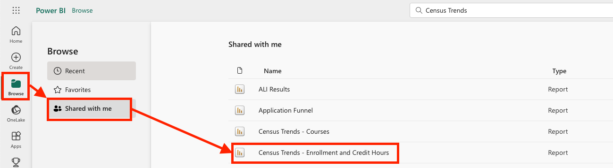
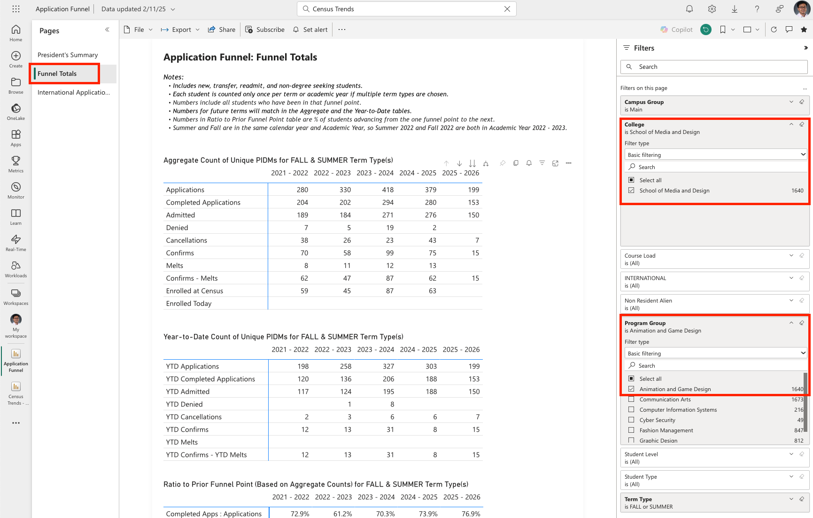

# Check Census

the census trend can be found on PowerBI:
Go to Browse->Shared with me, and pick the one named ```Census Trends - Enrollment and Credit Hours```



another useful place to go is the application funel, it shows realtime stats of the student enrollment:

