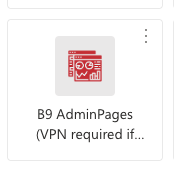
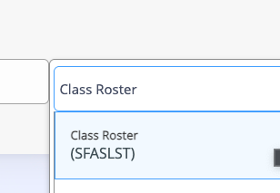
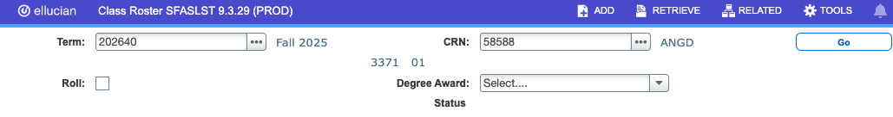

# Find Who is Registered for a Course

* Go to cardinal Apps, and find ```B9 Admin Pages```



* In the serach bar, type in ```Class Roaster``` and get in the class roaster:



* Put in the Term and CRN, and press the Go Button:
  


And the registered students show up as a list.


 