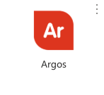
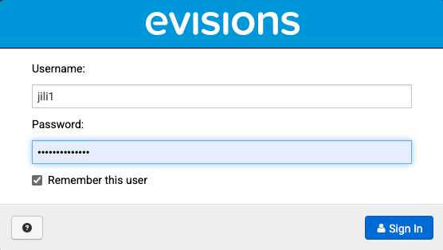
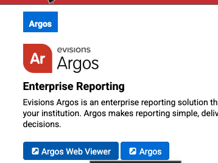
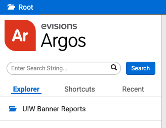
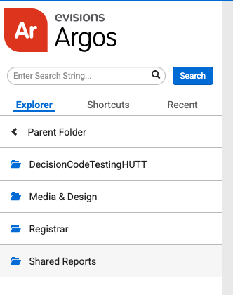
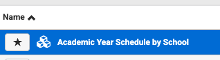

# Find Instructors for Each Course on Argos

* Go to Cardinal Apps and Find ```Argos```:



The login user name should be your local part of your university email, and the password is the same password you login to your cardinal apps:



It may take a while to log in.

* Go to the ```Arogs Web Viewer```



* In the left side panel, go to ```UIW Banner Reports```->```Shared Reports```->```Academic Year Schedule by School```







* It looks like I do not have access to this...
