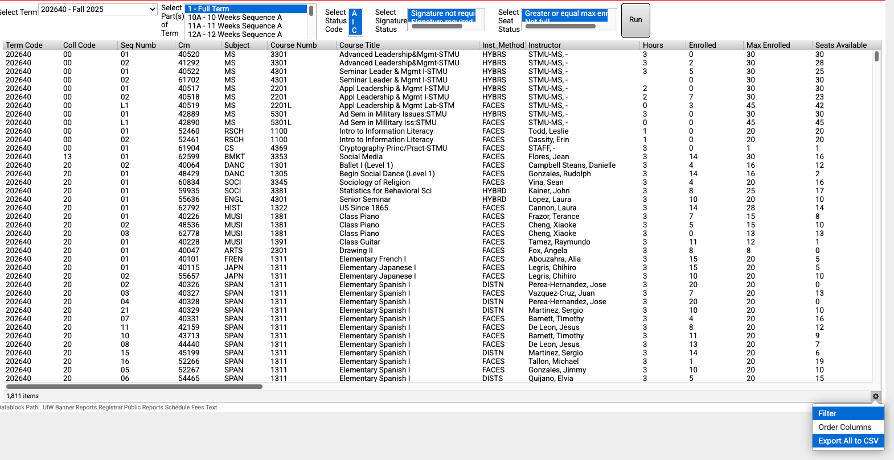

# Find Instructors and Student Count for Each Course on Argos

* Go to Cardinal Apps and Find ```Argos```:


The login user name should be your local part of your university email, and the password is the same password you login to your cardinal apps:


It may take a while to log in.

* Go to the ```Arogs Web Viewer```


* Pick ```UIW Banner Reports``` under the Explorer category in the left side panel:


* Go to UIW Banner Reports > Registra > Public Reports -> Schedule Fees Text

in the Select Term, pick the term, and in the Select Part(s) of Term, select ```1-Full Term```  ```G1 - Graduate Mini I Term``` ```G2 - Graduate Mini II Term```, Select Status Code ```A``` ```I``` ```C```, and options in Signature Status, and Seat Status, and press the ```Run``` button:


This should show the list of all the courses, and you can click on the Gear button on the lower right and Export All to CSV:



This can be viewed and checked against the ```New Undergraduates Eligible for Registration``` on PowerBI (Find it in your favorites).

## I Should have Access to this short cut soon:

* In the left side panel, go to ```UIW Banner Reports```->```Shared Reports```->```Academic Year Schedule by School```


