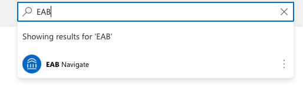
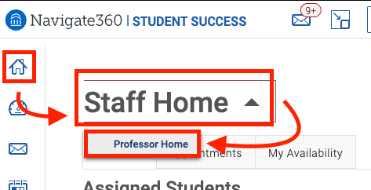
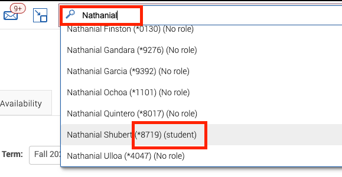
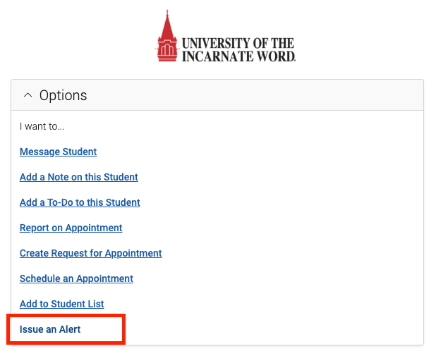
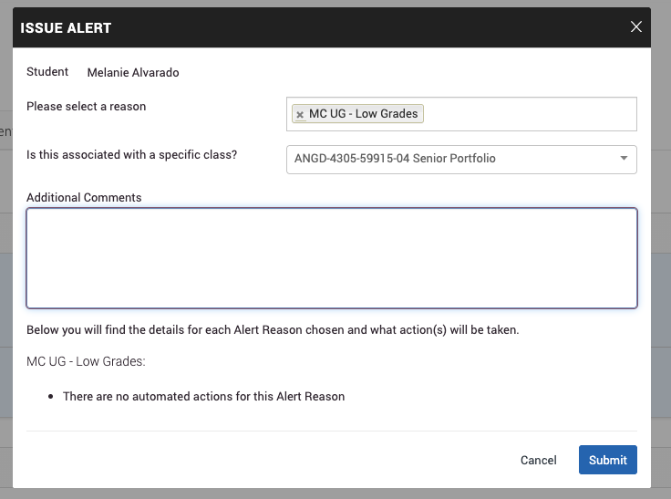

# Issue An Alert

We should issue an aleart if a student is not doing well in class.

### Steps:

- Open Cardinal Apps and find EAB Navigate:
  


- Click on the Home Button on the upper left corner, and change the Staff Home to Professor Home.



- Search for the student with their names in the search bar at the top center, if mutiple student with the same name apears, find the one with the role (student):



- After the student is loaded, go to the Options panel on the right side of the webpage, and click on ```Issue an Alert```



- In the pop up Issue Alert page, pick a reason, and add addtional comment, and click on Submit.

