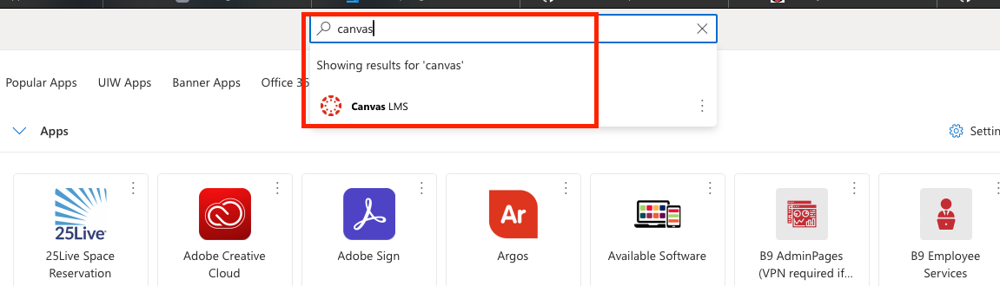
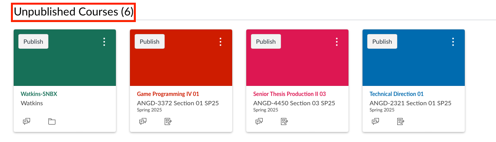
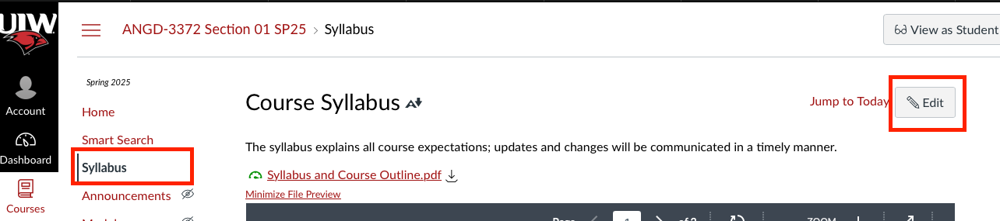
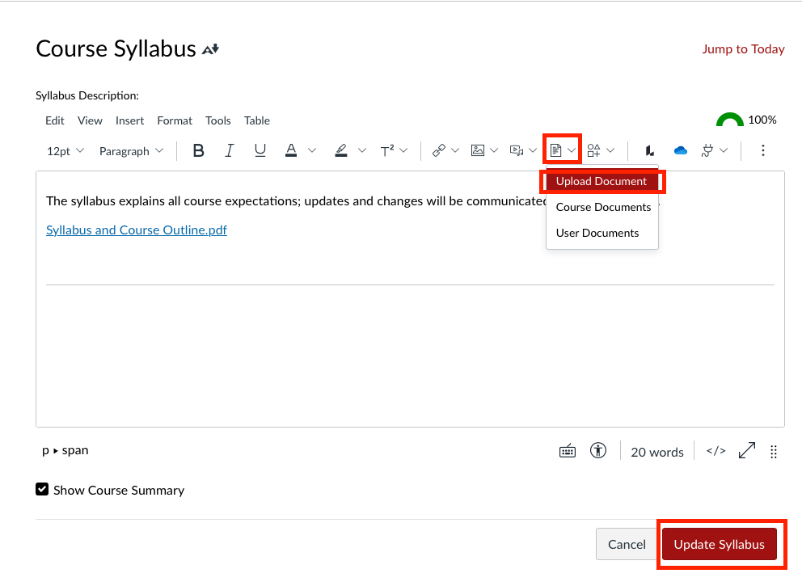
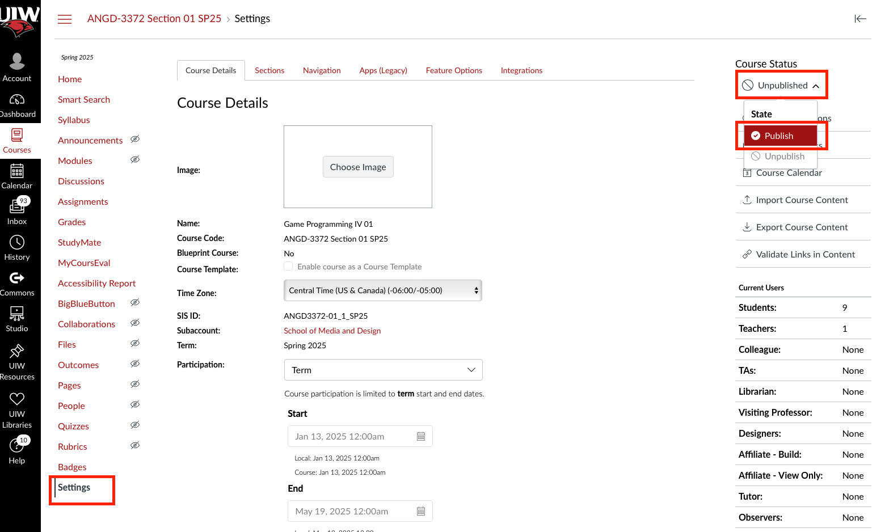

# Setup Your New Course

1, Go to [Cardinal Apps](https://myapps.microsoft.com), log in with your UIW email credentails. Go to the Search Bar and search for ```Canvas``` and click on it in the dropdown list:



2, On Canvas, your courses should be listed under the ```Unpublished Courses``` section, click on the course you need to setup:



3, Once you get into the couse, click on the ```Syllabus``` category in the left side bar, if the bar is not showing, you may need to maximzie the window. Click on the ```Edit``` button on the upper right to edit the Syllabus:



4, I recommend you remove the content in it, write your simple greeting, and click on the button with the file icon, and select ```Upload Document``` and upload both your syllabus and your class outline. You will need to click on the ```Update Syllabus``` button on the bottom right to update the change:



5, You will have to publish the course to make it avaliable for the students. To do so, click on the ```Settings``` category, and click the button on the upper right corner that says ```Unpublished```, and change it to Published:

